# neural-computer - Dependency Graph

**Version**: 0.1.0 | **Last Updated**: 2026-04-16

This document provides a comprehensive dependency graph of all files, components, imports, functions, and variables in the codebase.

---

## Table of Contents

1. [Overview](#overview)
2. [App Dependencies](#app-dependencies)
3. [Catalog Dependencies](#catalog-dependencies)
4. [Entry Dependencies](#entry-dependencies)
5. [Memory Dependencies](#memory-dependencies)
6. [Orchestrator Dependencies](#orchestrator-dependencies)
7. [Renderer Dependencies](#renderer-dependencies)
8. [Runtime Dependencies](#runtime-dependencies)
9. [Types Dependencies](#types-dependencies)
10. [Dependency Matrix](#dependency-matrix)
11. [Circular Dependency Analysis](#circular-dependency-analysis)
12. [Visual Dependency Graph](#visual-dependency-graph)
13. [Summary Statistics](#summary-statistics)

---

## Overview

The codebase is organized into the following modules:

- **app**: 2 files
- **catalog**: 2 files
- **entry**: 1 file
- **memory**: 2 files
- **orchestrator**: 2 files
- **renderer**: 4 files
- **runtime**: 2 files
- **types**: 2 files

---

## App Dependencies

### `src/app/index.ts` - index module

**Internal Dependencies:**
| File | Imports | Type |
|------|---------|------|
| `./nc-app` | `NCApp, type NCAppProps` | Re-export |

**Exports:**
- Re-exports: `NCApp`, `type NCAppProps`

---

### `src/app/nc-app.tsx` - Factory that takes the NCApp's internal `setTree` reference and

**External Dependencies:**
| Package | Import |
|---------|--------|
| `react` | `React` |
| `@json-ui/core` | `Catalog, UITree` |

**Internal Dependencies:**
| File | Imports | Type |
|------|---------|------|
| `../renderer` | `NCRenderer` | Import |
| `../types` | `NCRuntime, NCCatalogVersion, NCIntentHandler` | Import (type-only) |

**Exports:**
- Interfaces: `NCAppProps`
- Functions: `NCApp`

---

## Catalog Dependencies

### `src/catalog/index.ts` - index module

**Internal Dependencies:**
| File | Imports | Type |
|------|---------|------|
| `./nc-catalog` | `ncStarterCatalog, NC_CATALOG_VERSION` | Re-export |

**Exports:**
- Re-exports: `ncStarterCatalog`, `NC_CATALOG_VERSION`

---

### `src/catalog/nc-catalog.ts` - Version string threaded through every emitted IntentEvent.catalog_version

**External Dependencies:**
| Package | Import |
|---------|--------|
| `@json-ui/core` | `createCatalog` |
| `zod` | `z` |

**Internal Dependencies:**
| File | Imports | Type |
|------|---------|------|
| `../types` | `NCCatalogVersion` | Import (type-only) |

**Exports:**
- Constants: `NC_CATALOG_VERSION`, `ncStarterCatalog`

---

## Entry Dependencies

### `src/index.ts` - Neural Computer — public entry point.

**Internal Dependencies:**
| File | Imports | Type |
|------|---------|------|
| `./catalog` | `ncStarterCatalog, NC_CATALOG_VERSION` | Re-export |
| `./runtime` | `createNCRuntime, type CreateNCRuntimeOptions` | Re-export |
| `./memory` | `defaultNCProjection, type NCProjectedData, type NCProjectedEntity` | Re-export |
| `./renderer` | `NCRenderer, NCContainer, NCText, NCTextField, NCCheckbox, NCButton, useCommittedTree, type NCRendererProps, type NCComponentProps, type UseCommittedTreeOptions` | Re-export |
| `./orchestrator` | `createStubIntentHandler, type CreateStubIntentHandlerOptions` | Re-export |
| `./app` | `NCApp, type NCAppProps` | Re-export |

**Exports:**
- Re-exports: `ncStarterCatalog`, `NC_CATALOG_VERSION`, `createNCRuntime`, `type CreateNCRuntimeOptions`, `defaultNCProjection`, `type NCProjectedData`, `type NCProjectedEntity`, `NCRenderer`, `NCContainer`, `NCText`, `NCTextField`, `NCCheckbox`, `NCButton`, `useCommittedTree`, `type NCRendererProps`, `type NCComponentProps`, `type UseCommittedTreeOptions`, `createStubIntentHandler`, `type CreateStubIntentHandlerOptions`, `NCApp`, `type NCAppProps`

---

## Memory Dependencies

### `src/memory/index.ts` - index module

**Internal Dependencies:**
| File | Imports | Type |
|------|---------|------|
| `./projection` | `defaultNCProjection, type NCProjectedData, type NCProjectedEntity` | Re-export |

**Exports:**
- Re-exports: `defaultNCProjection`, `type NCProjectedData`, `type NCProjectedEntity`

---

### `src/memory/projection.ts` - The flat view NC exposes to @json-ui/react's DataProvider via the

**External Dependencies:**
| Package | Import |
|---------|--------|
| `@danielsimonjr/memoryjs` | `Entity, Relation, GraphProjection, JSONValue` |

**Exports:**
- Interfaces: `NCProjectedData`, `NCProjectedEntity`
- Constants: `defaultNCProjection`

---

## Orchestrator Dependencies

### `src/orchestrator/handle-intent.ts` - Options for the stub intent handler. The stub is deterministic —

**External Dependencies:**
| Package | Import |
|---------|--------|
| `@json-ui/core` | `IntentEvent, UITree` |

**Internal Dependencies:**
| File | Imports | Type |
|------|---------|------|
| `../types` | `NCIntentHandler` | Import (type-only) |

**Exports:**
- Interfaces: `CreateStubIntentHandlerOptions`
- Functions: `createStubIntentHandler`

---

### `src/orchestrator/index.ts` - index module

**Internal Dependencies:**
| File | Imports | Type |
|------|---------|------|
| `./handle-intent` | `createStubIntentHandler, type CreateStubIntentHandlerOptions` | Re-export |

**Exports:**
- Re-exports: `createStubIntentHandler`, `type CreateStubIntentHandlerOptions`

---

## Renderer Dependencies

### `src/renderer/index.ts` - index module

**Internal Dependencies:**
| File | Imports | Type |
|------|---------|------|
| `./input-components` | `NCContainer, NCText, NCTextField, NCCheckbox, NCButton, type NCComponentProps` | Re-export |
| `./nc-renderer` | `NCRenderer, type NCRendererProps` | Re-export |
| `./use-committed-tree` | `useCommittedTree, type UseCommittedTreeOptions` | Re-export |

**Exports:**
- Re-exports: `NCContainer`, `NCText`, `NCTextField`, `NCCheckbox`, `NCButton`, `type NCComponentProps`, `NCRenderer`, `type NCRendererProps`, `useCommittedTree`, `type UseCommittedTreeOptions`

---

### `src/renderer/input-components.tsx` - Props shape used by all NC-authored React components. Matches the

**External Dependencies:**
| Package | Import |
|---------|--------|
| `react` | `React` |
| `@json-ui/react` | `useStagingField, useActions` |
| `@json-ui/core` | `UIElement` |

**Exports:**
- Interfaces: `NCComponentProps`
- Functions: `NCContainer`, `NCText`, `NCTextField`, `NCCheckbox`, `NCButton`

---

### `src/renderer/nc-renderer.tsx` - Maps NC-authored React components to the ComponentRegistry shape

**External Dependencies:**
| Package | Import |
|---------|--------|
| `react` | `React` |
| `@json-ui/react` | `JSONUIProvider, Renderer, ComponentRegistry, ComponentRenderer` |
| `@json-ui/core` | `collectFieldIds, Catalog, IntentEvent, UITree` |

**Internal Dependencies:**
| File | Imports | Type |
|------|---------|------|
| `./input-components` | `NCContainer, NCText, NCTextField, NCCheckbox, NCButton` | Import |
| `../types` | `NCRuntime, NCCatalogVersion` | Import (type-only) |

**Exports:**
- Interfaces: `NCRendererProps`
- Functions: `NCRenderer`

---

### `src/renderer/use-committed-tree.ts` - Thin wrapper around @json-ui/react's useUIStream that pre-selects

**External Dependencies:**
| Package | Import |
|---------|--------|
| `@json-ui/react` | `useUIStream, UseUIStreamOptions` |

**Exports:**
- Functions: `useCommittedTree`

---

## Runtime Dependencies

### `src/runtime/context.ts` - Options for createNCRuntime. The caller supplies an

**External Dependencies:**
| Package | Import |
|---------|--------|
| `@json-ui/core` | `createStagingBuffer, IntentEvent, ObservableDataModel` |

**Internal Dependencies:**
| File | Imports | Type |
|------|---------|------|
| `../types` | `NCIntentHandler, NCRuntime` | Import (type-only) |

**Exports:**
- Interfaces: `CreateNCRuntimeOptions`
- Functions: `createNCRuntime`

---

### `src/runtime/index.ts` - index module

**Internal Dependencies:**
| File | Imports | Type |
|------|---------|------|
| `./context` | `createNCRuntime, type CreateNCRuntimeOptions` | Re-export |

**Exports:**
- Re-exports: `createNCRuntime`, `type CreateNCRuntimeOptions`

---

## Types Dependencies

### `src/types/index.ts` - index module

---

### `src/types/nc-types.ts` - An NC intent handler receives a fully-formed IntentEvent from the

**External Dependencies:**
| Package | Import |
|---------|--------|
| `@json-ui/core` | `IntentEvent, StagingBuffer, ObservableDataModel` |

---

## Dependency Matrix

### File Import/Export Matrix

| File | Imports From | Exports To |
|------|--------------|------------|
| `index` | 1 files | 1 files |
| `nc-app` | 2 files | 1 files |
| `index` | 1 files | 1 files |
| `nc-catalog` | 1 files | 1 files |
| `index` | 6 files | 0 files |
| `index` | 1 files | 1 files |
| `projection` | 0 files | 1 files |
| `handle-intent` | 1 files | 1 files |
| `index` | 1 files | 1 files |
| `index` | 3 files | 2 files |
| `input-components` | 0 files | 2 files |
| `nc-renderer` | 2 files | 1 files |
| `use-committed-tree` | 0 files | 1 files |
| `context` | 1 files | 1 files |
| `index` | 1 files | 1 files |
| `index` | 0 files | 5 files |
| `nc-types` | 0 files | 0 files |

---

## Circular Dependency Analysis

**No circular dependencies detected.**
---

## Visual Dependency Graph

```mermaid
graph TD
    subgraph App
        N0[index]
        N1[nc-app]
    end

    subgraph Catalog
        N2[index]
        N3[nc-catalog]
    end

    subgraph Entry
        N4[index]
    end

    subgraph Memory
        N5[index]
        N6[projection]
    end

    subgraph Orchestrator
        N7[handle-intent]
        N8[index]
    end

    subgraph Renderer
        N9[index]
        N10[input-components]
        N11[nc-renderer]
        N12[use-committed-tree]
    end

    subgraph Runtime
        N13[context]
        N14[index]
    end

    subgraph Types
        N15[index]
        N16[nc-types]
    end

    N0 --> N1
    N1 --> N9
    N1 --> N15
    N2 --> N3
    N3 --> N15
    N4 --> N2
    N4 --> N14
    N4 --> N5
    N4 --> N9
    N4 --> N8
    N4 --> N0
    N5 --> N6
    N7 --> N15
    N8 --> N7
    N9 --> N10
    N9 --> N11
    N9 --> N12
    N11 --> N10
    N11 --> N15
    N13 --> N15
    N14 --> N13
```

---

## Summary Statistics

| Category | Count |
|----------|-------|
| Total TypeScript Files | 17 |
| Total Modules | 8 |
| Total Lines of Code | 844 |
| Total Exports | 55 |
| Total Re-exports | 42 |
| Total Classes | 0 |
| Total Interfaces | 8 |
| Total Functions | 10 |
| Total Type Guards | 0 |
| Total Enums | 0 |
| Type-only Imports | 5 |
| Runtime Circular Deps | 0 |
| Type-only Circular Deps | 0 |

---

*Last Updated*: 2026-04-16
*Version*: 0.1.0
