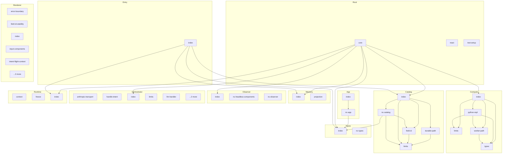

# neural-computer - Dependency Graph

**Version**: 0.1.0 | **Last Updated**: 2026-08-30

This document provides a comprehensive dependency graph of all files, components, imports, functions, and variables in the codebase.

---

## Table of Contents

1. [Overview](#overview)
2. [App Dependencies](#app-dependencies)
3. [Catalog Dependencies](#catalog-dependencies)
4. [Compute Dependencies](#compute-dependencies)
5. [Root Dependencies](#root-dependencies)
6. [Entry Dependencies](#entry-dependencies)
7. [Memory Dependencies](#memory-dependencies)
8. [Observer Dependencies](#observer-dependencies)
9. [Orchestrator Dependencies](#orchestrator-dependencies)
10. [Renderer Dependencies](#renderer-dependencies)
11. [Runtime Dependencies](#runtime-dependencies)
12. [Types Dependencies](#types-dependencies)
13. [Dependency Matrix](#dependency-matrix)
14. [Circular Dependency Analysis](#circular-dependency-analysis)
15. [Visual Dependency Graph](#visual-dependency-graph)
16. [Summary Statistics](#summary-statistics)

---

## Overview

The codebase is organized into the following modules:

- **app**: 2 files
- **catalog**: 5 files
- **compute**: 5 files
- **root**: 3 files
- **entry**: 1 file
- **memory**: 2 files
- **observer**: 3 files
- **orchestrator**: 7 files
- **renderer**: 8 files
- **runtime**: 3 files
- **types**: 2 files

---

## App Dependencies

### `src/app/index.ts` - SPDX-License-Identifier: Apache-2.0

**Internal Dependencies:**

| File       | Imports                  | Type      |
| ---------- | ------------------------ | --------- |
| `./nc-app` | `NCApp, type NCAppProps` | Re-export |

**Exports:**

- Re-exports: `NCApp`, `type NCAppProps`

---

### `src/app/nc-app.tsx` - Tree shown before any intent commits a replacement. Changing this

**External Dependencies:**

| Package          | Import              |
| ---------------- | ------------------- |
| `react`          | `React`             |
| `@json-ui/core`  | `UITree`            |
| `@json-ui/react` | `ComponentRegistry` |

**Internal Dependencies:**

| File                      | Imports                                                    | Type               |
| ------------------------- | ---------------------------------------------------------- | ------------------ |
| `../renderer/nc-renderer` | `NCRenderer`                                               | Import             |
| `../types`                | `AnyCatalog, NCRuntime, NCCatalogVersion, NCIntentHandler` | Import (type-only) |

**Exports:**

- Interfaces: `NCAppProps`
- Functions: `NCApp`

---

## Catalog Dependencies

### `src/catalog/durable-path.ts` - Durable-store paths are `/`-separated. Empty paths are a no-op in

**Internal Dependencies:**

| File       | Imports                                                                           | Type   |
| ---------- | --------------------------------------------------------------------------------- | ------ |
| `./limits` | `NC_DURABLE_PATH_MAX_LENGTH, NC_DURABLE_PATH_MAX_SEGMENTS, NC_RESERVED_FIELD_IDS` | Import |

**Exports:**

- Functions: `isSafeDurablePath`

---

### `src/catalog/field-id.ts` - Field IDs key the staging buffer. They must be non-empty, not a

**External Dependencies:**

| Package | Import |
| ------- | ------ |
| `zod`   | `z`    |

**Internal Dependencies:**

| File       | Imports                                         | Type   |
| ---------- | ----------------------------------------------- | ------ |
| `./limits` | `NC_FIELD_ID_MAX_LENGTH, NC_RESERVED_FIELD_IDS` | Import |

**Exports:**

- Functions: `isSafeFieldId`
- Constants: `ncFieldIdSchema`

---

### `src/catalog/index.ts` - SPDX-License-Identifier: Apache-2.0

**Internal Dependencies:**

| File             | Imports                                                                                                                                                                                                                                                                                                                               | Type      |
| ---------------- | ------------------------------------------------------------------------------------------------------------------------------------------------------------------------------------------------------------------------------------------------------------------------------------------------------------------------------------- | --------- |
| `./nc-catalog`   | `ncStarterCatalog, NC_CATALOG_VERSION, NC_LLM_ACCEPTANCE_CONTRACT`                                                                                                                                                                                                                                                                    | Re-export |
| `./field-id`     | `ncFieldIdSchema, isSafeFieldId`                                                                                                                                                                                                                                                                                                      | Re-export |
| `./durable-path` | `isSafeDurablePath`                                                                                                                                                                                                                                                                                                                   | Re-export |
| `./limits`       | `NC_FIELD_ID_MAX_LENGTH, NC_STRING_MAX_LENGTH, NC_ACTION_PARAM_MAX_KEYS, NC_STAGING_MAX_FIELDS, NC_SNAPSHOT_MAX_BYTES, NC_SELECT_MAX_OPTIONS, NC_DURABLE_PATH_MAX_LENGTH, NC_DURABLE_PATH_MAX_SEGMENTS, NC_DURABLE_VALUE_MAX_BYTES, NC_OBSERVER_STALE_THRESHOLD, NC_STARTER_ACTIONS, NC_RESERVED_FIELD_IDS, type NCStarterActionName` | Re-export |

**Exports:**

- Re-exports: `ncStarterCatalog`, `NC_CATALOG_VERSION`, `NC_LLM_ACCEPTANCE_CONTRACT`, `ncFieldIdSchema`, `isSafeFieldId`, `isSafeDurablePath`, `NC_FIELD_ID_MAX_LENGTH`, `NC_STRING_MAX_LENGTH`, `NC_ACTION_PARAM_MAX_KEYS`, `NC_STAGING_MAX_FIELDS`, `NC_SNAPSHOT_MAX_BYTES`, `NC_SELECT_MAX_OPTIONS`, `NC_DURABLE_PATH_MAX_LENGTH`, `NC_DURABLE_PATH_MAX_SEGMENTS`, `NC_DURABLE_VALUE_MAX_BYTES`, `NC_OBSERVER_STALE_THRESHOLD`, `NC_STARTER_ACTIONS`, `NC_RESERVED_FIELD_IDS`, `type NCStarterActionName`

---

### `src/catalog/limits.ts` - Caps for catalog strings and staging-bound input. Unbounded LLM-emitted

**Exports:**

- Constants: `NC_FIELD_ID_MAX_LENGTH`, `NC_STRING_MAX_LENGTH`, `NC_ACTION_PARAM_MAX_KEYS`, `NC_STAGING_MAX_FIELDS`, `NC_SNAPSHOT_MAX_BYTES`, `NC_SELECT_MAX_OPTIONS`, `NC_DURABLE_PATH_MAX_LENGTH`, `NC_DURABLE_PATH_MAX_SEGMENTS`, `NC_DURABLE_VALUE_MAX_BYTES`, `NC_OBSERVER_STALE_THRESHOLD`, `NC_STARTER_ACTIONS`, `NC_RESERVED_FIELD_IDS`

---

### `src/catalog/nc-catalog.ts` - Version string threaded through every emitted IntentEvent.catalog_version

**External Dependencies:**

| Package         | Import          |
| --------------- | --------------- |
| `@json-ui/core` | `createCatalog` |
| `zod`           | `z`             |

**Internal Dependencies:**

| File         | Imports                                                                                                            | Type   |
| ------------ | ------------------------------------------------------------------------------------------------------------------ | ------ |
| `../types`   | `asNCCatalogVersion`                                                                                               | Import |
| `./field-id` | `ncFieldIdSchema`                                                                                                  | Import |
| `./limits`   | `NC_ACTION_PARAM_MAX_KEYS, NC_RESERVED_FIELD_IDS, NC_SELECT_MAX_OPTIONS, NC_STRING_MAX_LENGTH, NC_STARTER_ACTIONS` | Import |

**Exports:**

- Constants: `NC_CATALOG_VERSION`, `NC_LLM_ACCEPTANCE_CONTRACT`, `ncStarterCatalog`

---

## Compute Dependencies

### `src/compute/index.ts` - SPDX-License-Identifier: Apache-2.0

**Internal Dependencies:**

| File            | Imports                                                                                                                                                                                                                                                              | Type      |
| --------------- | -------------------------------------------------------------------------------------------------------------------------------------------------------------------------------------------------------------------------------------------------------------------- | --------- |
| `./limits`      | `NC_REPL_CONTEXT_NAME, NC_REPL_DEFAULT_PYTHON, NC_REPL_DEFAULT_TIMEOUT_MS, NC_REPL_MAX_CODE_BYTES, NC_REPL_MAX_IDENT_LENGTH, NC_REPL_MAX_STDOUT_BYTES, NC_REPL_MAX_VALUE_BYTES, NC_REPL_MAX_LLM_PROMPT_BYTES, NC_REPL_MAX_LLM_REPLY_BYTES, NC_REPL_PROTOCOL_VERSION` | Re-export |
| `./types`       | `NCReplError, type NCReplErrorCode`                                                                                                                                                                                                                                  | Re-export |
| `./python-repl` | `createPythonRepl, createWorkerSpawnOptions`                                                                                                                                                                                                                         | Re-export |
| `./worker-path` | `resolveWorkerPath`                                                                                                                                                                                                                                                  | Re-export |

**Exports:**

- Re-exports: `NC_REPL_CONTEXT_NAME`, `NC_REPL_DEFAULT_PYTHON`, `NC_REPL_DEFAULT_TIMEOUT_MS`, `NC_REPL_MAX_CODE_BYTES`, `NC_REPL_MAX_IDENT_LENGTH`, `NC_REPL_MAX_STDOUT_BYTES`, `NC_REPL_MAX_VALUE_BYTES`, `NC_REPL_MAX_LLM_PROMPT_BYTES`, `NC_REPL_MAX_LLM_REPLY_BYTES`, `NC_REPL_PROTOCOL_VERSION`, `NCReplError`, `type NCReplErrorCode`, `createPythonRepl`, `createWorkerSpawnOptions`, `resolveWorkerPath`

---

### `src/compute/limits.ts` - Caps for the Python REPL worker. Unbounded snippets and prints would

**Exports:**

- Constants: `NC_REPL_DEFAULT_TIMEOUT_MS`, `NC_REPL_MAX_CODE_BYTES`, `NC_REPL_MAX_STDOUT_BYTES`, `NC_REPL_MAX_VALUE_BYTES`, `NC_REPL_MAX_IDENT_LENGTH`, `NC_REPL_MAX_LLM_PROMPT_BYTES`, `NC_REPL_MAX_LLM_REPLY_BYTES`, `NC_REPL_PROTOCOL_VERSION`, `NC_REPL_CONTEXT_NAME`, `NC_REPL_DEFAULT_PYTHON`

---

### `src/compute/python-repl.ts` - Minimal env + cwd for the worker. The child must not inherit host

**Node.js Built-in Dependencies:**

| Module          | Import                |
| --------------- | --------------------- |
| `child_process` | `spawn, ChildProcess` |
| `crypto`        | `randomUUID`          |
| `os`            | `tmpdir`              |

**Internal Dependencies:**

| File            | Imports                                                                                                                                                                                                                                                              | Type   |
| --------------- | -------------------------------------------------------------------------------------------------------------------------------------------------------------------------------------------------------------------------------------------------------------------- | ------ |
| `./limits`      | `NC_REPL_CONTEXT_NAME, NC_REPL_DEFAULT_PYTHON, NC_REPL_DEFAULT_TIMEOUT_MS, NC_REPL_MAX_CODE_BYTES, NC_REPL_MAX_IDENT_LENGTH, NC_REPL_MAX_LLM_PROMPT_BYTES, NC_REPL_MAX_LLM_REPLY_BYTES, NC_REPL_MAX_STDOUT_BYTES, NC_REPL_MAX_VALUE_BYTES, NC_REPL_PROTOCOL_VERSION` | Import |
| `./types`       | `NCReplError, CreatePythonReplOptions, NCPythonRepl, NCReplExecResult`                                                                                                                                                                                               | Import |
| `./worker-path` | `resolveWorkerPath`                                                                                                                                                                                                                                                  | Import |

**Exports:**

- Classes: `PythonRepl`
- Functions: `createWorkerSpawnOptions`, `createPythonRepl`

---

### `src/compute/types.ts` - Host implementation of the in-REPL `llm_query(prompt)` helper.

**Exports:**

- Classes: `NCReplError`
- Interfaces: `CreatePythonReplOptions`, `NCReplExecResult`, `NCPythonRepl`

---

### `src/compute/worker-path.ts` - Locate worker.py next to this module (source tree) or next to the

**Node.js Built-in Dependencies:**

| Module | Import          |
| ------ | --------------- |
| `fs`   | `existsSync`    |
| `path` | `dirname, join` |
| `url`  | `fileURLToPath` |

**Internal Dependencies:**

| File      | Imports       | Type   |
| --------- | ------------- | ------ |
| `./types` | `NCReplError` | Import |

**Exports:**

- Functions: `resolveWorkerPath`

---

## Root Dependencies

### `src/core.ts` - React-free entry for Node / orchestrator processes.

**Internal Dependencies:**

| File             | Imports                                                                                                                                                                                                                                                                                                                                                                                                                                                                                                                                   | Type      |
| ---------------- | ----------------------------------------------------------------------------------------------------------------------------------------------------------------------------------------------------------------------------------------------------------------------------------------------------------------------------------------------------------------------------------------------------------------------------------------------------------------------------------------------------------------------------------------- | --------- |
| `./catalog`      | `ncStarterCatalog, NC_CATALOG_VERSION, NC_LLM_ACCEPTANCE_CONTRACT, ncFieldIdSchema, isSafeFieldId, isSafeDurablePath, NC_FIELD_ID_MAX_LENGTH, NC_STRING_MAX_LENGTH, NC_STAGING_MAX_FIELDS, NC_SNAPSHOT_MAX_BYTES, NC_STARTER_ACTIONS`                                                                                                                                                                                                                                                                                                     | Re-export |
| `./types`        | `asNCCatalogVersion, isNCCatalogVersion`                                                                                                                                                                                                                                                                                                                                                                                                                                                                                                  | Re-export |
| `./runtime`      | `createNCRuntime, type CreateNCRuntimeOptions`                                                                                                                                                                                                                                                                                                                                                                                                                                                                                            | Re-export |
| `./memory`       | `defaultNCProjection, type NCProjectedData, type NCProjectedEntity, type NCProjectedRelation`                                                                                                                                                                                                                                                                                                                                                                                                                                             | Re-export |
| `./orchestrator` | `createStubIntentHandler, submittedFieldsStillPresent, type CreateStubIntentHandlerOptions, createLlmIntentHandler, composeNcObservation, createAnthropicTransport, createAnthropicIntentHandler, NCLlmError, NC_OBSERVATION_MAX_BYTES, NC_LLM_DEFAULT_MAX_ROUNDS, NC_LLM_MAX_ROUNDS, NC_LLM_DEFAULT_MAX_TOKENS, NC_DEFAULT_ANTHROPIC_MODEL, type CreateLlmIntentHandlerOptions, type DurableWrite, type NCLlmTransport, type NCLlmMessage, type NCLlmContent, type NCLlmTool, type CreateAnthropicTransportOptions, type NCLlmErrorCode` | Re-export |
| `./observer`     | `createNCObserver, ncHeadlessRegistry, type CreateNCObserverOptions`                                                                                                                                                                                                                                                                                                                                                                                                                                                                      | Re-export |
| `./compute`      | `createPythonRepl, resolveWorkerPath, NCReplError, NC_REPL_CONTEXT_NAME, NC_REPL_DEFAULT_PYTHON, NC_REPL_DEFAULT_TIMEOUT_MS, NC_REPL_MAX_CODE_BYTES, NC_REPL_MAX_IDENT_LENGTH, NC_REPL_MAX_STDOUT_BYTES, NC_REPL_MAX_VALUE_BYTES, NC_REPL_MAX_LLM_PROMPT_BYTES, NC_REPL_MAX_LLM_REPLY_BYTES, NC_REPL_PROTOCOL_VERSION, type CreatePythonReplOptions, type NCPythonRepl, type NCReplExecResult, type NCReplErrorCode`                                                                                                                      | Re-export |

**Exports:**

- Re-exports: `ncStarterCatalog`, `NC_CATALOG_VERSION`, `NC_LLM_ACCEPTANCE_CONTRACT`, `ncFieldIdSchema`, `isSafeFieldId`, `isSafeDurablePath`, `NC_FIELD_ID_MAX_LENGTH`, `NC_STRING_MAX_LENGTH`, `NC_STAGING_MAX_FIELDS`, `NC_SNAPSHOT_MAX_BYTES`, `NC_STARTER_ACTIONS`, `asNCCatalogVersion`, `isNCCatalogVersion`, `createNCRuntime`, `type CreateNCRuntimeOptions`, `defaultNCProjection`, `type NCProjectedData`, `type NCProjectedEntity`, `type NCProjectedRelation`, `createStubIntentHandler`, `submittedFieldsStillPresent`, `type CreateStubIntentHandlerOptions`, `createLlmIntentHandler`, `composeNcObservation`, `createAnthropicTransport`, `createAnthropicIntentHandler`, `NCLlmError`, `NC_OBSERVATION_MAX_BYTES`, `NC_LLM_DEFAULT_MAX_ROUNDS`, `NC_LLM_MAX_ROUNDS`, `NC_LLM_DEFAULT_MAX_TOKENS`, `NC_DEFAULT_ANTHROPIC_MODEL`, `type CreateLlmIntentHandlerOptions`, `type DurableWrite`, `type NCLlmTransport`, `type NCLlmMessage`, `type NCLlmContent`, `type NCLlmTool`, `type CreateAnthropicTransportOptions`, `type NCLlmErrorCode`, `createNCObserver`, `ncHeadlessRegistry`, `type CreateNCObserverOptions`, `createPythonRepl`, `resolveWorkerPath`, `NCReplError`, `NC_REPL_CONTEXT_NAME`, `NC_REPL_DEFAULT_PYTHON`, `NC_REPL_DEFAULT_TIMEOUT_MS`, `NC_REPL_MAX_CODE_BYTES`, `NC_REPL_MAX_IDENT_LENGTH`, `NC_REPL_MAX_STDOUT_BYTES`, `NC_REPL_MAX_VALUE_BYTES`, `NC_REPL_MAX_LLM_PROMPT_BYTES`, `NC_REPL_MAX_LLM_REPLY_BYTES`, `NC_REPL_PROTOCOL_VERSION`, `type CreatePythonReplOptions`, `type NCPythonRepl`, `type NCReplExecResult`, `type NCReplErrorCode`

---

### `src/react.ts` - SPDX-License-Identifier: Apache-2.0

**Internal Dependencies:**

| File         | Imports                                                                                                                                                                                      | Type      |
| ------------ | -------------------------------------------------------------------------------------------------------------------------------------------------------------------------------------------- | --------- |
| `./renderer` | `NCRenderer, NCContainer, NCText, NCTextField, NCCheckbox, NCSelect, NCButton, useCommittedTree, NCErrorBoundary, type NCRendererProps, type NCComponentProps, type UseCommittedTreeOptions` | Re-export |
| `./app`      | `NCApp, type NCAppProps`                                                                                                                                                                     | Re-export |

**Exports:**

- Re-exports: `NCRenderer`, `NCContainer`, `NCText`, `NCTextField`, `NCCheckbox`, `NCSelect`, `NCButton`, `useCommittedTree`, `NCErrorBoundary`, `type NCRendererProps`, `type NCComponentProps`, `type UseCommittedTreeOptions`, `NCApp`, `type NCAppProps`

---

### `src/test-setup.ts` - SPDX-License-Identifier: Apache-2.0

**External Dependencies:**

| Package                  | Import      |
| ------------------------ | ----------- |
| `vitest`                 | `afterEach` |
| `@testing-library/react` | `cleanup`   |

---

## Entry Dependencies

### `src/index.ts` - Neural Computer — public entry point.

**Internal Dependencies:**

| File             | Imports                                                                                                                                                                                                                                                                                                                                                                                                                                                                                                                                   | Type      |
| ---------------- | ----------------------------------------------------------------------------------------------------------------------------------------------------------------------------------------------------------------------------------------------------------------------------------------------------------------------------------------------------------------------------------------------------------------------------------------------------------------------------------------------------------------------------------------- | --------- |
| `./catalog`      | `ncStarterCatalog, NC_CATALOG_VERSION, NC_LLM_ACCEPTANCE_CONTRACT, ncFieldIdSchema, isSafeFieldId, isSafeDurablePath, NC_FIELD_ID_MAX_LENGTH, NC_STRING_MAX_LENGTH, NC_STAGING_MAX_FIELDS, NC_SNAPSHOT_MAX_BYTES, NC_STARTER_ACTIONS`                                                                                                                                                                                                                                                                                                     | Re-export |
| `./types`        | `asNCCatalogVersion, isNCCatalogVersion`                                                                                                                                                                                                                                                                                                                                                                                                                                                                                                  | Re-export |
| `./runtime`      | `createNCRuntime, type CreateNCRuntimeOptions`                                                                                                                                                                                                                                                                                                                                                                                                                                                                                            | Re-export |
| `./memory`       | `defaultNCProjection, type NCProjectedData, type NCProjectedEntity, type NCProjectedRelation`                                                                                                                                                                                                                                                                                                                                                                                                                                             | Re-export |
| `./renderer`     | `NCRenderer, NCContainer, NCText, NCTextField, NCCheckbox, NCSelect, NCButton, useCommittedTree, NCErrorBoundary, type NCRendererProps, type NCComponentProps, type UseCommittedTreeOptions`                                                                                                                                                                                                                                                                                                                                              | Re-export |
| `./orchestrator` | `createStubIntentHandler, submittedFieldsStillPresent, type CreateStubIntentHandlerOptions, createLlmIntentHandler, composeNcObservation, createAnthropicTransport, createAnthropicIntentHandler, NCLlmError, NC_OBSERVATION_MAX_BYTES, NC_LLM_DEFAULT_MAX_ROUNDS, NC_LLM_MAX_ROUNDS, NC_LLM_DEFAULT_MAX_TOKENS, NC_DEFAULT_ANTHROPIC_MODEL, type CreateLlmIntentHandlerOptions, type DurableWrite, type NCLlmTransport, type NCLlmMessage, type NCLlmContent, type NCLlmTool, type CreateAnthropicTransportOptions, type NCLlmErrorCode` | Re-export |
| `./app`          | `NCApp, type NCAppProps`                                                                                                                                                                                                                                                                                                                                                                                                                                                                                                                  | Re-export |
| `./observer`     | `createNCObserver, ncHeadlessRegistry, type CreateNCObserverOptions`                                                                                                                                                                                                                                                                                                                                                                                                                                                                      | Re-export |
| `./compute`      | `createPythonRepl, resolveWorkerPath, NCReplError, NC_REPL_CONTEXT_NAME, NC_REPL_DEFAULT_PYTHON, NC_REPL_DEFAULT_TIMEOUT_MS, NC_REPL_MAX_CODE_BYTES, NC_REPL_MAX_IDENT_LENGTH, NC_REPL_MAX_STDOUT_BYTES, NC_REPL_MAX_VALUE_BYTES, NC_REPL_MAX_LLM_PROMPT_BYTES, NC_REPL_MAX_LLM_REPLY_BYTES, NC_REPL_PROTOCOL_VERSION, type CreatePythonReplOptions, type NCPythonRepl, type NCReplExecResult, type NCReplErrorCode`                                                                                                                      | Re-export |

**Exports:**

- Re-exports: `ncStarterCatalog`, `NC_CATALOG_VERSION`, `NC_LLM_ACCEPTANCE_CONTRACT`, `ncFieldIdSchema`, `isSafeFieldId`, `isSafeDurablePath`, `NC_FIELD_ID_MAX_LENGTH`, `NC_STRING_MAX_LENGTH`, `NC_STAGING_MAX_FIELDS`, `NC_SNAPSHOT_MAX_BYTES`, `NC_STARTER_ACTIONS`, `asNCCatalogVersion`, `isNCCatalogVersion`, `createNCRuntime`, `type CreateNCRuntimeOptions`, `defaultNCProjection`, `type NCProjectedData`, `type NCProjectedEntity`, `type NCProjectedRelation`, `NCRenderer`, `NCContainer`, `NCText`, `NCTextField`, `NCCheckbox`, `NCSelect`, `NCButton`, `useCommittedTree`, `NCErrorBoundary`, `type NCRendererProps`, `type NCComponentProps`, `type UseCommittedTreeOptions`, `createStubIntentHandler`, `submittedFieldsStillPresent`, `type CreateStubIntentHandlerOptions`, `createLlmIntentHandler`, `composeNcObservation`, `createAnthropicTransport`, `createAnthropicIntentHandler`, `NCLlmError`, `NC_OBSERVATION_MAX_BYTES`, `NC_LLM_DEFAULT_MAX_ROUNDS`, `NC_LLM_MAX_ROUNDS`, `NC_LLM_DEFAULT_MAX_TOKENS`, `NC_DEFAULT_ANTHROPIC_MODEL`, `type CreateLlmIntentHandlerOptions`, `type DurableWrite`, `type NCLlmTransport`, `type NCLlmMessage`, `type NCLlmContent`, `type NCLlmTool`, `type CreateAnthropicTransportOptions`, `type NCLlmErrorCode`, `NCApp`, `type NCAppProps`, `createNCObserver`, `ncHeadlessRegistry`, `type CreateNCObserverOptions`, `createPythonRepl`, `resolveWorkerPath`, `NCReplError`, `NC_REPL_CONTEXT_NAME`, `NC_REPL_DEFAULT_PYTHON`, `NC_REPL_DEFAULT_TIMEOUT_MS`, `NC_REPL_MAX_CODE_BYTES`, `NC_REPL_MAX_IDENT_LENGTH`, `NC_REPL_MAX_STDOUT_BYTES`, `NC_REPL_MAX_VALUE_BYTES`, `NC_REPL_MAX_LLM_PROMPT_BYTES`, `NC_REPL_MAX_LLM_REPLY_BYTES`, `NC_REPL_PROTOCOL_VERSION`, `type CreatePythonReplOptions`, `type NCPythonRepl`, `type NCReplExecResult`, `type NCReplErrorCode`

---

## Memory Dependencies

### `src/memory/index.ts` - SPDX-License-Identifier: Apache-2.0

**Internal Dependencies:**

| File           | Imports                                                                                       | Type      |
| -------------- | --------------------------------------------------------------------------------------------- | --------- |
| `./projection` | `defaultNCProjection, type NCProjectedData, type NCProjectedEntity, type NCProjectedRelation` | Re-export |

**Exports:**

- Re-exports: `defaultNCProjection`, `type NCProjectedData`, `type NCProjectedEntity`, `type NCProjectedRelation`

---

### `src/memory/projection.ts` - The flat view NC exposes to @json-ui/react's DataProvider via the

**External Dependencies:**

| Package                   | Import                                         |
| ------------------------- | ---------------------------------------------- |
| `@danielsimonjr/memoryjs` | `Entity, Relation, GraphProjection, JSONValue` |

**Internal Dependencies:**

| File                | Imports | Type   |
| ------------------- | ------- | ------ |
| `../runtime/freeze` | `dict`  | Import |

**Exports:**

- Interfaces: `NCProjectedRelation`, `NCProjectedData`, `NCProjectedEntity`
- Constants: `defaultNCProjection`

---

## Observer Dependencies

### `src/observer/index.ts` - SPDX-License-Identifier: Apache-2.0

**Internal Dependencies:**

| File                       | Imports                                          | Type      |
| -------------------------- | ------------------------------------------------ | --------- |
| `./nc-observer`            | `createNCObserver, type CreateNCObserverOptions` | Re-export |
| `./nc-headless-components` | `ncHeadlessRegistry`                             | Re-export |

**Exports:**

- Re-exports: `createNCObserver`, `type CreateNCObserverOptions`, `ncHeadlessRegistry`

---

### `src/observer/nc-headless-components.ts` - Six headless components mirroring NC's React input-components surface.

**External Dependencies:**

| Package             | Import                                |
| ------------------- | ------------------------------------- |
| `@json-ui/headless` | `HeadlessComponent, HeadlessRegistry` |
| `@json-ui/core`     | `JSONValue, UIElement`                |

**Exports:**

- Constants: `ncHeadlessRegistry`

---

### `src/observer/nc-observer.ts` - Additional headless components merged under ncHeadlessRegistry.

**External Dependencies:**

| Package             | Import                                                                                                 |
| ------------------- | ------------------------------------------------------------------------------------------------------ |
| `@json-ui/headless` | `createHeadlessRenderer, JsonStringSerializer, createHtmlSerializer, HeadlessRegistry, NormalizedNode` |
| `@json-ui/core`     | `ObservableDataModel, StagingBuffer, UITree`                                                           |

**Internal Dependencies:**

| File                       | Imports                       | Type               |
| -------------------------- | ----------------------------- | ------------------ |
| `./nc-headless-components` | `ncHeadlessRegistry`          | Import             |
| `../catalog/limits`        | `NC_OBSERVER_STALE_THRESHOLD` | Import             |
| `../runtime/freeze`        | `freezeDeep`                  | Import             |
| `../types`                 | `AnyCatalog, NCObserver`      | Import (type-only) |

**Exports:**

- Interfaces: `CreateNCObserverOptions`
- Functions: `createNCObserver`

---

## Orchestrator Dependencies

### `src/orchestrator/anthropic-transport.ts` - Inject a send function to avoid constructing a real client (tests).

**External Dependencies:**

| Package             | Import      |
| ------------------- | ----------- |
| `@anthropic-ai/sdk` | `Anthropic` |

**Internal Dependencies:**

| File              | Imports                                                                                           | Type               |
| ----------------- | ------------------------------------------------------------------------------------------------- | ------------------ |
| `./limits`        | `NC_DEFAULT_ANTHROPIC_MODEL, NC_LLM_DEFAULT_MAX_TOKENS`                                           | Import             |
| `./llm-transport` | `NCLlmCompleteRequest, NCLlmContent, NCLlmToolResultContent, NCLlmToolUseContent, NCLlmTransport` | Import (type-only) |
| `./llm-handler`   | `createLlmIntentHandler, CreateLlmIntentHandlerOptions`                                           | Import             |
| `../types`        | `NCIntentHandler`                                                                                 | Import (type-only) |

**Exports:**

- Interfaces: `CreateAnthropicTransportOptions`
- Functions: `createAnthropicTransport`, `createAnthropicIntentHandler`

---

### `src/orchestrator/handle-intent.ts` - Options for the stub intent handler. The stub is deterministic —

**External Dependencies:**

| Package         | Import                                 |
| --------------- | -------------------------------------- |
| `@json-ui/core` | `collectFieldIds, IntentEvent, UITree` |

**Internal Dependencies:**

| File       | Imports                       | Type               |
| ---------- | ----------------------------- | ------------------ |
| `../types` | `AnyCatalog, NCIntentHandler` | Import (type-only) |

**Exports:**

- Interfaces: `CreateStubIntentHandlerOptions`
- Functions: `createStubIntentHandler`, `submittedFieldsStillPresent`

---

### `src/orchestrator/index.ts` - SPDX-License-Identifier: Apache-2.0

**Internal Dependencies:**

| File                    | Imports                                                                                                                                                                                   | Type      |
| ----------------------- | ----------------------------------------------------------------------------------------------------------------------------------------------------------------------------------------- | --------- |
| `./handle-intent`       | `createStubIntentHandler, submittedFieldsStillPresent, type CreateStubIntentHandlerOptions`                                                                                               | Re-export |
| `./observation`         | `composeNcObservation, type ComposeNcObservationInput, type NcObservation`                                                                                                                | Re-export |
| `./llm-handler`         | `createLlmIntentHandler, type CreateLlmIntentHandlerOptions, type DurableWrite`                                                                                                           | Re-export |
| `./llm-transport`       | `NCLlmError, type NCLlmErrorCode, type NCLlmTransport, type NCLlmMessage, type NCLlmContent, type NCLlmTool, type NCLlmCompleteRequest, type NCLlmCompleteResponse`                       | Re-export |
| `./anthropic-transport` | `createAnthropicTransport, createAnthropicIntentHandler, type CreateAnthropicTransportOptions`                                                                                            | Re-export |
| `./limits`              | `NC_OBSERVATION_MAX_BYTES, NC_LLM_DEFAULT_MAX_ROUNDS, NC_LLM_MAX_ROUNDS, NC_LLM_MAX_TOOLS_PER_ROUND, NC_LLM_MAX_TOOL_RESULT_BYTES, NC_LLM_DEFAULT_MAX_TOKENS, NC_DEFAULT_ANTHROPIC_MODEL` | Re-export |

**Exports:**

- Re-exports: `createStubIntentHandler`, `submittedFieldsStillPresent`, `type CreateStubIntentHandlerOptions`, `composeNcObservation`, `type ComposeNcObservationInput`, `type NcObservation`, `createLlmIntentHandler`, `type CreateLlmIntentHandlerOptions`, `type DurableWrite`, `NCLlmError`, `type NCLlmErrorCode`, `type NCLlmTransport`, `type NCLlmMessage`, `type NCLlmContent`, `type NCLlmTool`, `type NCLlmCompleteRequest`, `type NCLlmCompleteResponse`, `createAnthropicTransport`, `createAnthropicIntentHandler`, `type CreateAnthropicTransportOptions`, `NC_OBSERVATION_MAX_BYTES`, `NC_LLM_DEFAULT_MAX_ROUNDS`, `NC_LLM_MAX_ROUNDS`, `NC_LLM_MAX_TOOLS_PER_ROUND`, `NC_LLM_MAX_TOOL_RESULT_BYTES`, `NC_LLM_DEFAULT_MAX_TOKENS`, `NC_DEFAULT_ANTHROPIC_MODEL`

---

### `src/orchestrator/limits.ts` - SPDX-License-Identifier: Apache-2.0

**Exports:**

- Constants: `NC_OBSERVATION_MAX_BYTES`, `NC_LLM_DEFAULT_MAX_ROUNDS`, `NC_LLM_MAX_ROUNDS`, `NC_LLM_MAX_TOOLS_PER_ROUND`, `NC_LLM_MAX_TOOL_RESULT_BYTES`, `NC_LLM_DEFAULT_MAX_TOKENS`, `NC_DEFAULT_ANTHROPIC_MODEL`

---

### `src/orchestrator/llm-handler.ts` - LLM-backed intent handler. Same signature as the stub. Commits one

**External Dependencies:**

| Package         | Import                                                        |
| --------------- | ------------------------------------------------------------- |
| `@json-ui/core` | `generateCatalogPrompt, validateJSONValue, JSONValue, UITree` |

**Internal Dependencies:**

| File              | Imports                                                                                                  | Type               |
| ----------------- | -------------------------------------------------------------------------------------------------------- | ------------------ |
| `../catalog`      | `isSafeDurablePath, NC_DURABLE_VALUE_MAX_BYTES, NC_LLM_ACCEPTANCE_CONTRACT`                              | Import             |
| `../compute`      | `NCPythonRepl`                                                                                           | Import (type-only) |
| `../types`        | `AnyCatalog, NCIntentHandler, NCRuntime`                                                                 | Import (type-only) |
| `./limits`        | `NC_LLM_DEFAULT_MAX_ROUNDS, NC_LLM_MAX_ROUNDS, NC_LLM_MAX_TOOL_RESULT_BYTES, NC_LLM_MAX_TOOLS_PER_ROUND` | Import             |
| `./llm-transport` | `NCLlmError, NCLlmContent, NCLlmMessage, NCLlmTool, NCLlmToolUseContent, NCLlmTransport`                 | Import             |
| `./observation`   | `composeNcObservation`                                                                                   | Import             |

**Exports:**

- Interfaces: `DurableWrite`, `CreateLlmIntentHandlerOptions`
- Functions: `createLlmIntentHandler`

---

### `src/orchestrator/llm-transport.ts` - One model round. Tests inject a fake; production uses

**Exports:**

- Classes: `NCLlmError`
- Interfaces: `NCLlmMessage`, `NCLlmTool`, `NCLlmCompleteRequest`, `NCLlmCompleteResponse`, `NCLlmTransport`

---

### `src/orchestrator/observation.ts` - Build the stable system prompt and the size-capped user JSON for one

**External Dependencies:**

| Package         | Import        |
| --------------- | ------------- |
| `@json-ui/core` | `IntentEvent` |

**Internal Dependencies:**

| File       | Imports                    | Type   |
| ---------- | -------------------------- | ------ |
| `./limits` | `NC_OBSERVATION_MAX_BYTES` | Import |

**Exports:**

- Interfaces: `ComposeNcObservationInput`, `NcObservation`
- Functions: `composeNcObservation`

---

## Renderer Dependencies

### `src/renderer/error-boundary.tsx` - Catches render throws from NC components so a single bad cast cannot

**External Dependencies:**

| Package | Import  |
| ------- | ------- |
| `react` | `React` |

**Exports:**

- Classes: `NCErrorBoundary`

---

### `src/renderer/field-id-stability.ts` - SPDX-License-Identifier: Apache-2.0

**External Dependencies:**

| Package         | Import   |
| --------------- | -------- |
| `@json-ui/core` | `UITree` |

**Exports:**

- Classes: `FieldIdTypeChangeError`
- Functions: `collectFieldIdTypes`, `detectFieldIdTypeChanges`, `commitFieldIdTypes`

---

### `src/renderer/index.ts` - SPDX-License-Identifier: Apache-2.0

**Internal Dependencies:**

| File                   | Imports                                                                                   | Type      |
| ---------------------- | ----------------------------------------------------------------------------------------- | --------- |
| `./input-components`   | `NCContainer, NCText, NCTextField, NCCheckbox, NCSelect, NCButton, type NCComponentProps` | Re-export |
| `./nc-renderer`        | `NCRenderer, type NCRendererProps`                                                        | Re-export |
| `./use-committed-tree` | `useCommittedTree, type UseCommittedTreeOptions`                                          | Re-export |
| `./error-boundary`     | `NCErrorBoundary`                                                                         | Re-export |
| `./field-id-stability` | `collectFieldIdTypes, detectFieldIdTypeChanges, FieldIdTypeChangeError`                   | Re-export |

**Exports:**

- Re-exports: `NCContainer`, `NCText`, `NCTextField`, `NCCheckbox`, `NCSelect`, `NCButton`, `type NCComponentProps`, `NCRenderer`, `type NCRendererProps`, `useCommittedTree`, `type UseCommittedTreeOptions`, `NCErrorBoundary`, `collectFieldIdTypes`, `detectFieldIdTypeChanges`, `FieldIdTypeChangeError`

---

### `src/renderer/input-components.tsx` - Props shape used by all NC-authored React components. Matches the

**External Dependencies:**

| Package          | Import                        |
| ---------------- | ----------------------------- |
| `react`          | `React`                       |
| `@json-ui/react` | `useStagingField, useActions` |
| `@json-ui/core`  | `UIElement`                   |

**Internal Dependencies:**

| File                      | Imports                                  | Type   |
| ------------------------- | ---------------------------------------- | ------ |
| `../catalog/limits`       | `NC_STRING_MAX_LENGTH`                   | Import |
| `./intent-flight-context` | `FocusFieldContext, IntentFlightContext` | Import |

**Exports:**

- Interfaces: `NCComponentProps`
- Constants: `NCContainer`, `NCText`, `NCTextField`, `NCCheckbox`, `NCSelect`, `NCButton`

---

### `src/renderer/intent-flight-context.ts` - True while createNCRuntime is awaiting a handler. NCButton reads this

**External Dependencies:**

| Package | Import  |
| ------- | ------- |
| `react` | `React` |

**Exports:**

- Constants: `IntentFlightContext`, `FocusFieldContext`

---

### `src/renderer/nc-renderer.tsx` - The committed tree to render. Must come from a successful stream

**External Dependencies:**

| Package          | Import                                        |
| ---------------- | --------------------------------------------- |
| `react`          | `React`                                       |
| `@json-ui/react` | `JSONUIProvider, Renderer, ComponentRegistry` |
| `@json-ui/core`  | `collectFieldIds, IntentEvent, UITree`        |

**Internal Dependencies:**

| File                      | Imports                                                             | Type               |
| ------------------------- | ------------------------------------------------------------------- | ------------------ |
| `./input-components`      | `NCContainer, NCText, NCTextField, NCCheckbox, NCSelect, NCButton`  | Import             |
| `../types`                | `AnyCatalog, NCRuntime, NCCatalogVersion`                           | Import (type-only) |
| `./error-boundary`        | `NCErrorBoundary`                                                   | Import             |
| `./intent-flight-context` | `FocusFieldContext, IntentFlightContext`                            | Import             |
| `./field-id-stability`    | `collectFieldIdTypes, commitFieldIdTypes, detectFieldIdTypeChanges` | Import             |
| `./read-only-store`       | `readOnlyDurableStore`                                              | Import             |

**Exports:**

- Interfaces: `NCRendererProps`
- Functions: `NCRenderer`

---

### `src/renderer/read-only-store.ts` - React DataProvider must not mutate durable state. Built-in NC inputs

**External Dependencies:**

| Package         | Import                           |
| --------------- | -------------------------------- |
| `@json-ui/core` | `JSONValue, ObservableDataModel` |

**Exports:**

- Functions: `readOnlyDurableStore`

---

### `src/renderer/use-committed-tree.ts` - Thin wrapper around @json-ui/react's useUIStream that pre-selects

**External Dependencies:**

| Package          | Import                            |
| ---------------- | --------------------------------- |
| `@json-ui/react` | `useUIStream, UseUIStreamOptions` |

**Exports:**

- Functions: `useCommittedTree`

---

## Runtime Dependencies

### `src/runtime/context.ts` - Options for createNCRuntime. The caller supplies an

**External Dependencies:**

| Package             | Import                                                  |
| ------------------- | ------------------------------------------------------- |
| `@json-ui/core`     | `createStagingBuffer, IntentEvent, ObservableDataModel` |
| `@json-ui/headless` | `HeadlessRegistry`                                      |

**Internal Dependencies:**

| File                | Imports                                                                     | Type               |
| ------------------- | --------------------------------------------------------------------------- | ------------------ |
| `../observer`       | `createNCObserver`                                                          | Import             |
| `../catalog/limits` | `NC_OBSERVER_STALE_THRESHOLD, NC_SNAPSHOT_MAX_BYTES, NC_STAGING_MAX_FIELDS` | Import             |
| `../types`          | `asNCCatalogVersion`                                                        | Import             |
| `../types`          | `AnyCatalog, NCCatalogVersion, NCIntentHandler, NCRuntime`                  | Import (type-only) |
| `../catalog`        | `NC_CATALOG_VERSION`                                                        | Import             |

**Exports:**

- Interfaces: `CreateNCRuntimeOptions`
- Functions: `createNCRuntime`

---

### `src/runtime/freeze.ts` - SPDX-License-Identifier: Apache-2.0

**Exports:**

- Functions: `freezeDeep`, `dict`

---

### `src/runtime/index.ts` - SPDX-License-Identifier: Apache-2.0

**Internal Dependencies:**

| File        | Imports                                        | Type      |
| ----------- | ---------------------------------------------- | --------- |
| `./context` | `createNCRuntime, type CreateNCRuntimeOptions` | Re-export |
| `./freeze`  | `freezeDeep, dict`                             | Re-export |

**Exports:**

- Re-exports: `createNCRuntime`, `type CreateNCRuntimeOptions`, `freezeDeep`, `dict`

---

## Types Dependencies

### `src/types/index.ts` - SPDX-License-Identifier: Apache-2.0

**Internal Dependencies:**

| File         | Imports                                  | Type      |
| ------------ | ---------------------------------------- | --------- |
| `./nc-types` | `asNCCatalogVersion, isNCCatalogVersion` | Re-export |

**Exports:**

- Re-exports: `asNCCatalogVersion`, `isNCCatalogVersion`

---

### `src/types/nc-types.ts` - Re-export of `@json-ui/core`'s `AnyCatalog`. Method variance makes a

**External Dependencies:**

| Package             | Import                                                                |
| ------------------- | --------------------------------------------------------------------- |
| `@json-ui/core`     | `IntentEvent, StagingBuffer, ObservableDataModel, UITree, AnyCatalog` |
| `@json-ui/headless` | `NormalizedNode`                                                      |

**Exports:**

- Interfaces: `NCObserver`, `NCRuntime`
- Functions: `isNCCatalogVersion`, `asNCCatalogVersion`

---

## Dependency Matrix

### File Import/Export Matrix

| File                     | Imports From | Exports To |
| ------------------------ | ------------ | ---------- |
| `index`                  | 1 files      | 2 files    |
| `nc-app`                 | 2 files      | 1 files    |
| `durable-path`           | 1 files      | 1 files    |
| `field-id`               | 1 files      | 2 files    |
| `index`                  | 4 files      | 4 files    |
| `limits`                 | 0 files      | 7 files    |
| `nc-catalog`             | 3 files      | 1 files    |
| `index`                  | 4 files      | 3 files    |
| `limits`                 | 0 files      | 2 files    |
| `python-repl`            | 3 files      | 1 files    |
| `types`                  | 0 files      | 3 files    |
| `worker-path`            | 1 files      | 2 files    |
| `core`                   | 7 files      | 0 files    |
| `index`                  | 9 files      | 0 files    |
| `index`                  | 1 files      | 2 files    |
| `projection`             | 1 files      | 1 files    |
| `index`                  | 2 files      | 3 files    |
| `nc-headless-components` | 0 files      | 2 files    |
| `nc-observer`            | 4 files      | 1 files    |
| `anthropic-transport`    | 4 files      | 1 files    |
| `handle-intent`          | 1 files      | 1 files    |
| `index`                  | 6 files      | 2 files    |
| `limits`                 | 0 files      | 4 files    |
| `llm-handler`            | 6 files      | 2 files    |
| `llm-transport`          | 0 files      | 3 files    |
| `observation`            | 1 files      | 2 files    |
| `react`                  | 2 files      | 0 files    |
| `error-boundary`         | 0 files      | 2 files    |
| `field-id-stability`     | 0 files      | 2 files    |
| `index`                  | 5 files      | 2 files    |

---

## Circular Dependency Analysis

**No circular dependencies detected.**
---

## Visual Dependency Graph

```mermaid
graph TD
    subgraph App
        N0[index]
        N1[nc-app]
    end

    subgraph Catalog
        N2[durable-path]
        N3[field-id]
        N4[index]
        N5[limits]
        N6[nc-catalog]
    end

    subgraph Compute
        N7[index]
        N8[limits]
        N9[python-repl]
        N10[types]
        N11[worker-path]
    end

    subgraph Root
        N12[core]
        N13[react]
        N14[test-setup]
    end

    subgraph Entry
        N15[index]
    end

    subgraph Memory
        N16[index]
        N17[projection]
    end

    subgraph Observer
        N18[index]
        N19[nc-headless-components]
        N20[nc-observer]
    end

    subgraph Orchestrator
        N21[anthropic-transport]
        N22[handle-intent]
        N23[index]
        N24[limits]
        N25[llm-handler]
        N26[...2 more]
    end

    subgraph Renderer
        N27[error-boundary]
        N28[field-id-stability]
        N29[index]
        N30[input-components]
        N31[intent-flight-context]
        N32[...3 more]
    end

    subgraph Runtime
        N33[context]
        N34[freeze]
        N35[index]
    end

    subgraph Types
        N36[index]
        N37[nc-types]
    end

    N0 --> N1
    N1 --> N36
    N2 --> N5
    N3 --> N5
    N4 --> N6
    N4 --> N3
    N4 --> N2
    N4 --> N5
    N6 --> N36
    N6 --> N3
    N6 --> N5
    N7 --> N8
    N7 --> N10
    N7 --> N9
    N7 --> N11
    N9 --> N8
    N9 --> N10
    N9 --> N11
    N11 --> N10
    N12 --> N4
    N12 --> N36
    N12 --> N35
    N12 --> N16
    N12 --> N23
    N12 --> N18
    N12 --> N7
    N15 --> N4
    N15 --> N36
    N15 --> N35
    N15 --> N16
```

---

## Summary Statistics

| Category                | Count |
| ----------------------- | ----- |
| Total TypeScript Files  | 41    |
| Total Modules           | 11    |
| Total Lines of Code     | 3714  |
| Total Exports           | 311   |
| Total Re-exports        | 239   |
| Total Classes           | 5     |
| Total Interfaces        | 24    |
| Total Functions         | 24    |
| Total Type Guards       | 3     |
| Total Enums             | 0     |
| Type-only Imports       | 9     |
| Runtime Circular Deps   | 0     |
| Type-only Circular Deps | 0     |

---

_Last Updated_: 2026-08-30
_Version_: 0.1.0
